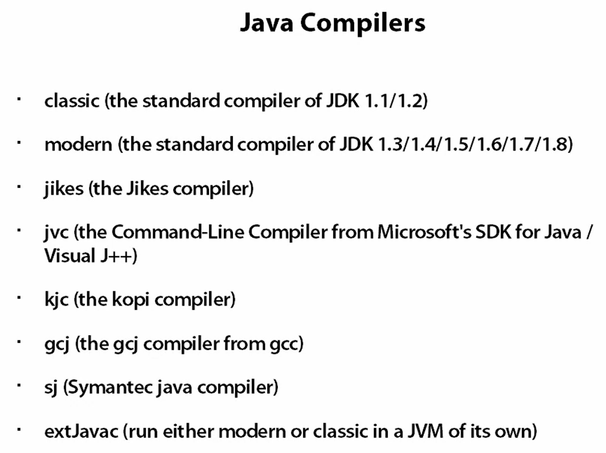
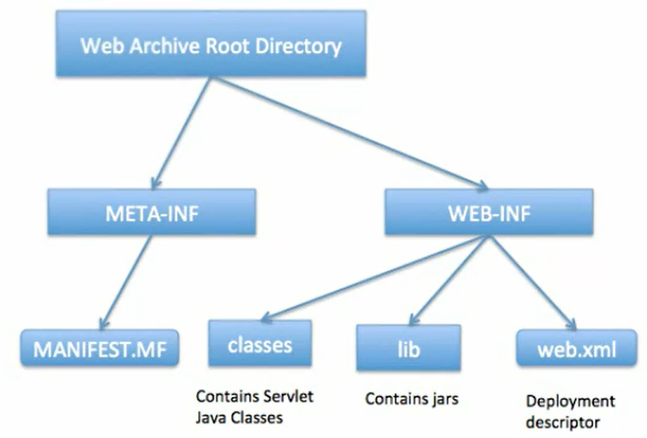
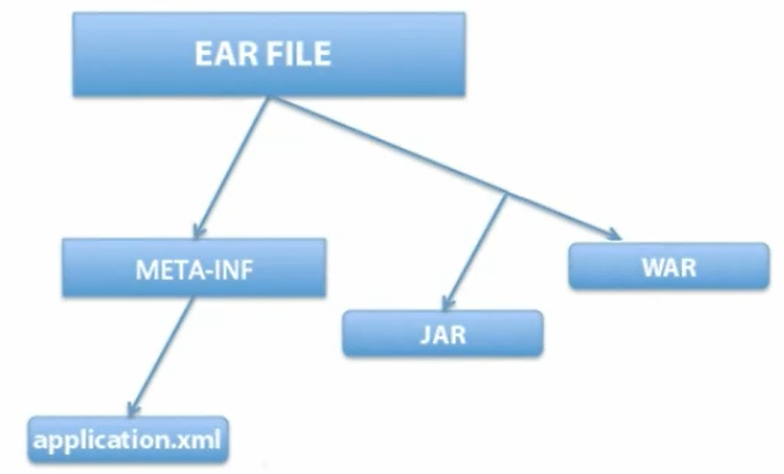
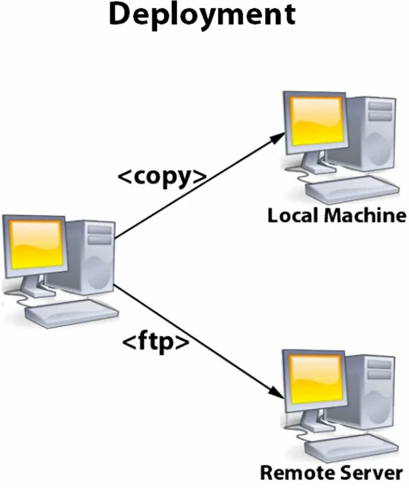
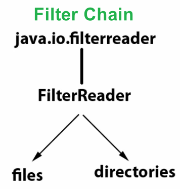
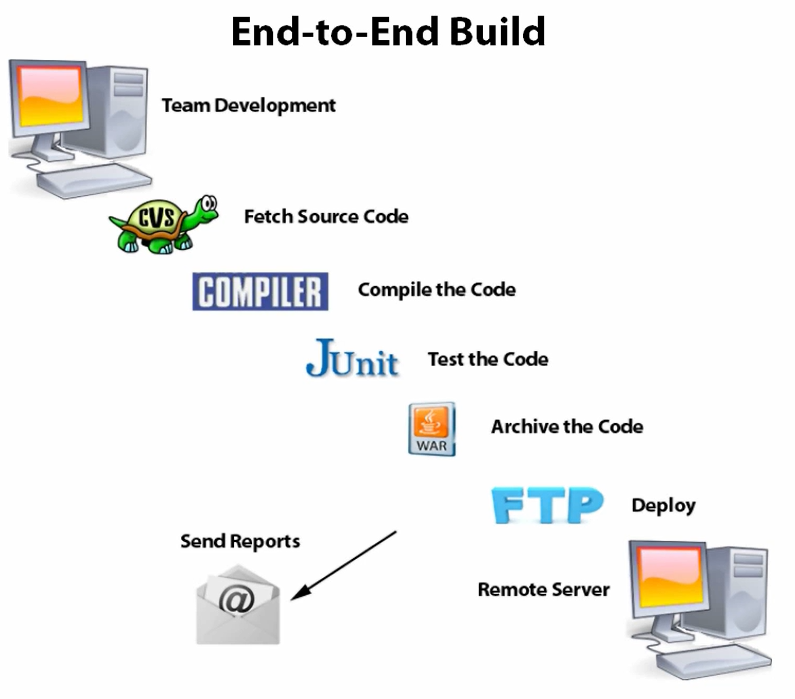

# Apache Ant

# Chapter 1 - Intro:

### 1. in cmd, type "ant" will try to find a build.xml file to run by default#

### 2. use "ant -buildfile xxx.xml" to decide which .xml file to run#

### 3. integrate ANT into an IDE

# Chapter 2 - Tasks:

## 1. Ant Munual - tasks (https://ant.apache.org/manual/tasksoverview.html)

## 2. Compile Tasks

### 2.1 list of alternate compilers can be used:


## 3. Archive Tasks

### 3.1 JAR task - java application archive
### 3.2 WAR task - web application archive

### 3.3 EAR task - enterprise application archive


## 4. File Tasks

### 4.1 concat
```xml
<project name="Concat Example" default="concatfile" basedir=".">
    <target name="concatfile">
        <concat destfile="etc/READ_ME.txt" append="yes">Hello, World!</concat>
    </target>
</project>
```
### 4.2 copy
### 4.3 get
### 4.4 move
### 4.5 replace
```xml
<project name="Replace Example" default="replacetoken" basedir=".">
    <target name="replacetoken">
        <replace file="" token="to_be_replaced" value="use_this_to_replace" />
    </target>
</project>
```
### 4.6 sync
### 4.7 Attrib (windows only)
### 4.8 Chmod (Unix only)

## 5. JavaDoc Tasks
```xml
<project name="JavaDoc Example" default="javadoc" basedir=".">
	<target name="javadoc">
		<javadoc    packagenames="com.pluralsight.*"
                    sourcepath="src"
                    excludepackagenames="com.pluralsight.test.*"
                    defaultexcludes="yes"
                    destdir="docs/api"
                    author="true"
                    version="true"
                    use="true"
                    windowtitle="pluralsight API">
			<doctitle><![CDATA[<h1>Pluralsight</h1>]]></doctitle>
			<bottom><![CDATA[<i>Copyright &#169;2014 Pluralsight.com.
                                All Rights Reserved.</i>]]></bottom>
		</javadoc>
	</target>
</project>
```

## 6. Property Tasks

### 6.1 Built-In Properties
#### 6.1.1 ant.file - The full location of the build file
#### 6.1.2 ant.version-TheversionoftheApacheAntinstallation
#### 6.1.3 Basedir -The basedir of the build
#### 6.1.4 ant.java.version - The version of the JDK that is used by Ant.
#### 6.1.5 ant.project.name - The name of the project
#### 6.1.6 ant.project.default-target - The default target of the current project
#### 6.1.7 ant.project.invoked-targets - List of the targets invoked in the current project
#### 6.1.8 ant.core.lib - The full location of the ant jar file
#### 6.1.9 ant.home - The home directory of Ant installation
#### 6.1.10 ant.library.dir - The home directory for Ant library files

### 6.2 property examples:
#### 6.2.1 create build.properties using key-value pair define properties, then use properties in property.xml
```xml
<project name="property example" default="printproperties" basedir=".">
	<property file="build.properties"/>
	<target name="printproperties">
		<echo>Project Name: ${project.name}</echo>
		<echo>Source Dir: ${src.dir}</echo>
		<echo>Build Dir: ${build.dir}</echo>
		<echo>Classes Dir: ${classes.dir}</echo>
		<echo>Etc Dir: ${etc.dir}</echo>
	</target>
</project>
```
#### 6.2.2 use propertyfile.xml dynamically generate a dynamic.properties file
```xml
<project name="Property File Example" default="createfile" basedir=".">
	<target name="createfile">
		<propertyfile file="dynamic.properties">
			<entry key="date" type="date" value="now"/>
			<entry key="buildnumber" type="int" default="0" operation="+"/>
		</propertyfile>
	</target>
</project>
```
#### 6.2.3 use condition.xml to conditionally set property to true/false (only)?
```xml
<project name="Condition Example" basedir=".">
	<target name="testconditions">
        <!-- set property javamail.complete to true only two classnames are available -->
		<condition property="javamail.complete">
			<and>
				<available classname="javax.activation.DataHandler"/>
				<available classname="javax.mail.Transport"/>
			</and>
		</condition>
        <!-- set property isMacOsButNotMacOsX to true when os is mac not unix -->
		<condition property="isMacOsButNotMacOsX">
			<and>
				<os family="mac"/>
				<not>
					<os family="unix"/>
				</not>
			</and>
		</condition>
	</target>
</project>
```
#### 6.2.4 use properties in sample.xml inside xmlproperty.xml
```xml
<root-tag>
	<version value="0.0.1"/>
	<build folder="build">
		<classes id="build.classes" location="${build.folder}/classes"/>
		<reference refid="build.classes"/>
	</build>
	<compile>
		<classpath pathid="compile.classpath">
			<pathelement location="${build.classes}"/>
		</classpath>
	</compile>
	<run-time>
		<jars>*.jar</jars>
		<classpath pathid="run-time.classpath">
			<path refid="compile.classpath"/>
			<pathelement path="${run-tire.jars}"/>
		</classpath>
	</run-time>
</root-tag>
```
compare with normal way, notice the difference in tags
```xml
<project name="Xml Property Example" basedir=".">
    <!--Loads properties from the sample.xml file -->
    <xmlproperty file="sample.xml" keepRoot="false" semanticAttributes="true"/>

    <!-- This is the equivalent of setting these properties -->
    <property name="version" value="0.0.1"/>
    <property name="build.folder" value="build"/>
    <property name="build.classes" location="${build.folder}/classes" id="build.classes"/>
    <property name="build.reference" refid="build.classes"/>
    <property name="run-time.jars" value="*.jar"/>

    <path id="compile.classpath">
        <pathelement location="${build.classes}"/>
    </path>

    <path id="run-time.classpath">
        <path refid="compile.classpath"/>
        <pathelement path="${run-time.jars}"/>
    </path>
</project>
```

## 7. Version Control Tasks

### 7.1 Examples:

#### 7.1.1 use cvs.xml to check out source code from CVS repository
```xml
<project name="version Control Examples" default="cvsupate" basedir=".">

	<target name="init" description="Initializes properties">
		<property name="src.dir" value="src"/>
	</target>

	<!-- normally just update a cvs source directorys -->
	<target name="cvsupdate" depends="init">
		<cvs dest="${src.dir}" command="update"/>
	</target>

	<!-- checkout from cvsroot -->
	<target name="checkout" depends="init">
		<cvs 	cvsRoot=":pserver:anoncvs@cvs.apache.org:/home/cvspublic"
				package="com/oncue/android/vocalease"
				dest="${src.dir}"
		/>
	</target>

	<!-- ability to send command to commandline -->
	<target name="commandline">
		<cvs output="patch">
			<commandline>
				<argument value="-q"/>
				<argument value="diff"/>
				<argument value="-u"/>
				<argument value="-N"/>
			</commandline>
		</cvs>
	</target>

</project>
```
#### 7.1.2 Visual SourceSafe (VSS)
#### 7.1.3 ClearCase
#### 7.1.4 Continuus/Synergy
#### 7.1.5 PVCS
#### 7.1.6 SourceOffsite

## 8. JUnit Tasks

### 8.1 see example in junit_example/junit
### 8.2 for test case to run, need to include junit.jar and hamcrest.jar

## 9. Mail Tasks

### 9.1 Mail task can send SMTP email, depend mail.jar and activation.jar
```xml
<project name="Mail Example" default="mail" basedir=".">
	<target name="mail">
		<mail 	mailhost="smtp.gmail.com" 
				user="test@gmail.com" 
				password="" 
				ssl="true" 
				mailport="465" 
				subject="Test build">
			<from address="test@gmail.com"/>
			<to address="test@gmail.com"/>
			<message>The nightly build has completed</message>
			<attachments>
				<fileset dir="reports">
					<include name="**/*.zip"/>
				</fileset>
			</attachments>
		</mail>
	</target>
</project>
```

## 10. Remote Tasks

### 10.1 Remote tasks can run ant task on remote machine, using ftp, need to include jsch.jar

```xml
<project name="Deploy Example" default="ftp" basedir=".">

	<!--init target is hidden -includes my top secret ftp info -->
	
	<target name="copy" depends="init">
		<copy file="${docs.dir}/test.html" todir="${deploy.dir}"/>
	</target>

	<target name="ftp" depends="init">
		<ftp 	server="${server.name}" 
				remotedir="${remote.dir}" 
				userid="${user.id}" 
				password="${password}" 
				passive="yes" 
				binary="no" 
				verbose="yes">
			<fileset dir="${docs.dir}">
				<include name="*.html"/>
			</fileset>
		</ftp>
	</target>

</project>
```

## 11. XML Tasks

### 11.1 XML Tasks can be used to manipulate xml files, need to include xalan.jar and saxon.jar
#### 11.1.1 Create catalog.xml
```xml
<CATALOG>
	<CD>
		<TITLE>Still got the blues</TITLE>
		<ARTIST>Gary Hoore
		</aRTIST>
		<COUNTRY>UK</COUNTRY>
		<COHPANY>Virgin records</COHPANY>
		<PRICE>10.20</PRICE>
		<YEAR>1990</YEAR>
	</CD>
	<CD>
		<TITLE>Haggie May</TITLE>
		<aRTIST>Rod Steuart</aRTIST>
		<COUNTRY>UK</COUNTRY>
		<COHPANY>PickWiCk</COHPANY>
		<PRICE>8.SO</PRICE>
		<YEAR>1990</YEAR>
	</CD>
</CATALOG>
```
#### 11.1.2 Create checkxml.xml, example of ant build file
```xml
<project name="XML Examples" default="checkxml" basedir=".">

	<target name="init" description="Initializes properties">
		<property name="files.dir" value="files"/>
		<property name="valid.dir" value="valid"/>
		<property name="invalid.dir" value="invalid"/>
	</target>

	<!-- checking if the xml file is well formatted, find inconsistency like missing closing tag etc. -->
	<target nare="checkxml" depends="init">
		<xmlvalidate>
			<!-- check all .xml files in dir -->
			<fileset dir="${files.dir}" includes="*.xml"/>
			<!-- disable validation/schema -->
			<attribute name="http://xml.org/sax/features/validation" value="false"/>
			<attribute name="http://apache.org/xml/features/validation/schema" value="false"/>
		</xmlvalidate>
	</target>

	<target name="validcheck" depends="init">
		<xmlvalidate>
			<fileset dir="${valid.dir}" includes="*.xml"/>
			<attribute name="http://xml.org/sax/features/validation" value="true"/>
			<attribute name="http://apache.org/xml/features/validation/schema" value="true"/>
			<attribute name="http://xml.org/sax/features/narmespaces" value="true"/>
		</xmlvalidate>
	</target>
	
	<target name="invalidcheck" depends="init">
		<xmlvalidate>
			<fileset dir="${invalid.dir}" includes="*.xml"/>
			<attribute name="http://xml.org/sax/features/validation" value="true"/>
			<attribute name="http://apache.org/xml/features/validation/schema" value="true"/>
			<attribute name="http://xml.org/sax/features/namespaces" value="true"/>
		</xmlvalidate>
	</target>

</project>
```
#### 11.1.3 Create valid.xml, point to schema schema.xsd
```xml
<MyMessages xmlns:xsi="http://www.w3.org/2001/xMLSchema-instance"
			xsi:noNamespaceSchemaLocation="schema.xsd">
	<MyMessage>Hello World!</MyMessage>
	<MyMessage>ANT AND XML Schema ROCK</MyMessage>
</MyMessages>
```
#### 11.1.4 xslt to transform xml file to other formats
```xml
<xsl:stylesheet version="1.0" xmlns:xsl="http://www.w3.org/1999/xSL/Transform">
	<xsl:output method="xml" version="1.0" encoding="UTF-8" indent="yes"/>
	<xsl:template match="/">
		<MyMessage>Hello World!</MyMessage>
	</xsl:template>
</xsl:stylesheet>
```
#### 11.1.5 Apache Tika, can be used to extract text from various file formats

# Chapter 3 - Elements:

## 1. Overview

## 2 PatternSet
- Groups of patterns of files or directories
### 1.1 Wildcard Characters:
- ? matches a single character
- \* matches zero or more characters
- ** matches zero or more directories recursively
### 2.2 Usage in patternset
```xml
<patternset id="classes">
	<include name="**/*.class"/>
	<exclude name="**/*Test*.class"/>
</patternset>
<patternset id="classes" 
			includes="**/*.class" 
			excludes="**/*Test*.class"/>
```
## 3 DirSet
- Groups of directories
```xml
<dirset dir="build">
	<patternset id="classes">
		<include name="**/classes"/>
		<exclude name="**/*Test*"/>
	</patternset>
</dirset>

<dirset dir="build">
	<include name="**/classes"/>
	<exclude name="**/*Test*"/>
</dirset>

<dirset dir="build"
		includes="**/classes"
		excludes="**/*Test*"/>
```
## 4 FileSet
- Groups of files
```xml
<!-- defaultexcludes="yes" means exclude common files like tmp/cds/backup -->
<fileset dir="build" defaultexcludes="yes">
	<patternset id="source">
		<include name="**/*.java"/>
		<exclude name="**/*Test*"/>
	</patternset>
</fileset>

<fileset dir="build" defaultexcludes="yes">
	<include name="**/*.java"/>
	<exclude name="**/*Test*"/>
</fileset>
<fileset 	dir="build" 
			defaultexcludes="yes" 
			includes="**/*.java" 
			excludes="**/*Test*"/>
```
## 4 FileList
- Explicit list of files
```xml
<!-- no wildcard patterns allowed, need to specify the actual file names -->
<filelist 	id="source" 
			dir="src" 
			files="SysConfig.java, IConstants.java, Encrypt.java"/>
```
## 5 FileMapper
- Translates file names
### 5.1 identity
- Target filename identical to source filename
### 5.2 flatten
- Directory structure is flattened
```xml
<project name="Filemapper flatten example" default="flatten" basedir=".">
	<target name="flatten">
		<copy todir="build/flatten">
			<!-- copy files from src dir to build/flatten dir without nested structure -->
			<mapper type="flatten"/>
			<fileset dir="src">
				<include name="**/*.java"/>
			</fileset>
		</copy>
	</target>
</project>
```
### 5.3 merge
- Target filename is the same for all source files
```xml
<project name="Filemapper merge example" default="merge" basedir=".">
	<target name="merge">
		<copy todir="build/merge">
			<!-- usually use in "update to date" (to overwrite old files?) -->
			<mapper type="merge" to="mge"/>
			<fileset dir="src">
				<include name="**/*.java"/>
			</fileset>
		</copy>
	</target>
</project>
```
### 5.4 glob
- Glob matching used on files
```xml
<project name="Filemapper glob example" default="glob" basedir=".">
	<target name="glob">
		<copy todir="build/glob">
			<!-- rename a group of files and maintain their nested structure -->
			<mapper type="glob" from="*.java" to="*.java.backup"/>
			<fileset dir="src">
				<include name="**/*.java"/>
			</fileset>
		</copy>
	</target>
</project>
```
### 5.5 regexp
- Regular expression matching used on files
```xml
<project name="Filemapper regexp example" default="regexp" basedir=".">
	<target name="regexp">
		<copy todir="build/regexp">
			<!-- same as glob -->
			 <!-- \1 refers to the first captured group from the from pattern, which is (.*). This group captures the base name of the file (the file name without the .java extension). -->
			<mapper type="regexp" from="^(.*).java$$" to="\1.java.backup"/>
			<fileset dir="src">
				<include name="**/*.java"/>
			</fileset>
		</copy>
	</target>
</project>
```
### 5.6 package
- Based on Java package of source files
```xml
<project name="Filemapper package example" default="package" basedir=",">
	<target name="package">
		<copy todir="build/package">
			<mapper type="package" from="*Test.java" to="TEST-*Test.xml"/>
			<fileset dir="src">
				<include name="**/*.java"/>
			</fileset>
		</copy>
	</target>
</project>
```
## 6 FilterReader - Filters files or directories
## 6.1 A filter chain: a chain of filter readers

## 6.2 Types
- stripjavacomments - Removes java comments from.java files
```xml
<project name="Strip java corments" default="strip" basedir=".">
	<target name="strip">
		<copy todir="build/stripjava">
			<filterchain>
				<stripjavacorments />
			</filterchain>
			<fileset dir="src">
				<include name="**/*.java"/>
			</fileset>
		</copy>
	</target>
</project>
```
- striplinecomments - Removes user-defined comment lines
```xml
<project name="Strip Lines Example" default="strip" basedir=".">
	<target name="strip">
		<copy todir="build/striplines">
			<filterchain>
				<striplinecommments>
					<!-- tell strip tool comments start with two dashes -->
					<comment value="--"/>
				</striplinecormments>
			</filterchain>
			<fileset dir="src">
				<includename="**/*.sql"/>
			</fileset>
		</copy>
	</target>
</project>
```
- striplinebreaks - Removes end-of-line characters
```xml
<!-- remove all line breaks -->
<project name="Strip Line breaks Example" default="strip" basedir=".">
	<target name="strip">
		<copy todir="build/striplinebreaks">
			<filterchain>
				<striplinebreaks/>
			</filterchain>
			<fileset dir="src">
				<include name="**/*.html"/>
			</fileset>
		</copy>
	</target>
</project>
```
- classconstants - Outputs name/value pairs of constants in class files
  - Requires the BCEL library in the classpath
```xml
<!-- extract all constants in .class in a key-value-pair format -->
<project name="Constants Example" default="constants" basedir=",">
	<target name="constants">
		<copy todir="build/constants">
			<filterchain>
				<classconstants />
			</filterchain>
			<fileset dir="classes">
				<include name="**/*.class"/>
			</fileset>
			<mapper type="glob" from="*.class" to="*.txt"/>
		</copy>
	</target>
</project>
```
- replacetokens - replaces tokens within files
```xml
<project name="Replace tokens example" default="replace" basedir=".">
	<!-- define a timestamp which will generate today's date -->
	<tstamp />

	<target name="replace">
		<copy todir="build/replacetokens">
			<filterchain>
				<replacetokens>
					<token key="TODAY" VALUE="${TODAY}"/>
				</replacetokens>
			</filterchain>
			<fileset dir="src">
				<include name="**/*.java"/>
			</fileset>
		</copy>
	</target>
</project>
```
- tabstospaces - Replaces tabs with a given number of spaces
- headfilter - Returns only the top given number of lines
- tailfilter - Returns only the botton given number of lines
- linecontains - Copies only lines containing a given string
- linecontainsregexp - Copies only lines matching a regexp
- prefixlines - Adds a string to the beginning of every line
- expandproperties - Expands Ant properties
## 7 FilterChain - Groups of FilterReaders
## 8 Selectors - Provide more control over file selection
```xml
<!-- date example, select file updated after this date -->
<fileset dir="${src.dir}" includes="**/*.java">
	<date datetime="01/01/2014 12:00 AM" when="after"/>
</fileset>
<!-- present example -->
<fileset dir="${v2.src.dir}" includes="**/*.java">
	<!-- present set to "srconly" (src dir) or "both" (src and target dir) -->
	<present present="srconly" targetdir="${v1.src.dir}"/>
</fileset>
<!-- size example, select file less than 1 Ki -->
<fileset dir="${src.dir}" includes="**/*.java">
	<size value="1" units="Ki" when="less"/>
</fileset>
<!-- contains example, select file contains string "TODO", not case sensitive -->
<fileset dir="${src.dir}" includes="**/*.java">
	<contains text="TODO" casesensitive="no"/>
</fileset>
<!-- containsregexp example -->
<fileset dir="${doc.path}" includes="*.txt">
	<containsregexp expression="[4-6]\.[0-9]"/>
</fileset>
<!-- depend example -->
<fileset dir="${ant.1.5}/src/main" includes="**/*.java">
	<depend targetdir="${ant.1.4}/src/main"/>
</fileset>
<!-- dlepth example -->
<fileset dir="${src.dir}" includes="**/*.java">
	<depth max="1"/>
</fileset>
<!-- different example -->
<fileset dir="${ant.1.5}/src/main" includes="**/*.java">
	<different 	targetdir="${ant.1.4}/src/main" 
				ignoreFileTimes="true"/>
</fileset>	
```
### 8.1 Selector Tpyes:
- modified
- signedselector
- scriptselector
- readable
- writable
### 8.2 Selector Containers:
- and
- or
- not
- none
```xml
<!-- and example -->
<fileset dir="${src.dir}" includes="**/*.java">
	<and>
		<size value="4" units="Ki" when="more"/>
		<date datetime="01/01/2001 12:00 AM" when="before"/>
	</and>
</fileset>
<!-- or example -->
<fileset dir="${image.dir}">
	<or>
		<filename name="*.png"/>
		<filename name="*.gif"/>
		<filenamename="*.jpg"/>
	</or>
</fileset>
<!-- not example -->
<fileset dir="${src.dir}" includes="**/*.java">
	<not>
		<contains text="test"/>
	</not>
</fileset>
<!-- none example -->
<fileset dir="${src.dir}" includes="**/*.java">
	<none>
		<!-- select only file not in dest dir -->
		<present targetdir="${dest.dir}"/>
	</none>
</fileset>
```
## 9 Class FileSet
- Groups of class files
### 9.1 ClassFileSet
- special set of fileset
```xml
<!-- 将tools/Util目录下的所有工具类打包为可重用的库 -->
<jar destfile="tools.jar">
	<fileset refid="reqdclasses"/>
</jar>
<classfileset id="reqdClasses"dir="${classes.dir}">
	<rootfileset 	dir="${classes.dir}" 
					includes="com/pluralsight/tools/Util*.class"/>
</classfileset>
```
## 10 Paths - Like file system paths
```xml
<project name="Paths Example" default="compile" basedir=".">
	<target name="init">
		<!-- usually define paths in init target -->
		<path id="classpath">
			<pathelement path="{$servlet.dir}/servlet.jar"/>
			<pathelement path="{$javamail.dir}/mail.jar"/>
			<fileset dir="{$lib.dir}">
				<include name="**/*.jar"/>
			</fileset>
		</path>
	</target>

	<target name="compile" depends="init">
		<javac srcdir="src" destdir="build">
			<!-- use refif point to path defined in init, and include another path -->
			<classpath>
				<path refid="classpath"/>
				<pathelement path="${xalan.jar}"/>
			</classpath>
		</javac>
	</target>
</project>
```
## 11 Listeners - Alerts for events within a build
## 11.1 Listeners Types:
- Build started
- Build finished
- Target started
- Target finished
- Task started
- Task finished
- Message logged
## 11.2 Loggers Types:
- DefaultLogger - default
- NoBannerLogger - simple
- TimestampedLogger - default with timestamp
- BigProjectLogger - details of sub projects
- SimpleBigProjectLogger
- ProfileLogger - print timestamp for each target and task
- AnsiColorLogger - only works in ANSI color terminal
- MailLogger
- Log4JListener
- XmlLogger
## 12 Loggers - Logging events


# Chapter 4 - Full Example:

## 1. End-to-End Build:

### 1.1 Init -initialize properties
### 1.2 Record - log the entire process
### 1.3 Prepare - create build and report directories
### 1.4 Fetch the source code
### 1.5 Compile the code
### 1.6 Test with JUnit
### 1.7 Build a WAR file
### 1.8 Deploy - FTP to the remote server
### 1.9 Send Mail - zip up reports and email
## 2. Build a Skeleton:
```xml
<!-- endtoend.xml -->
<!-- default target is sendmail -->
<project name="End to End Buila" default="sendmail" basedir=".">
	<target name="init">
		<tstamp/>
		<property file="build.properties"/>
		<!-- 4. Init Task add classpath to map to jars and set a property point to classpath for later use -->
		<path id="classpath">
			<pathelement path="${servlet.jar}"/>
			<pathelement path="${junit.jar}"/>
		</path>
		<property name="classpath" refid="classpath"/>
	</target>
	<target name="startrecorder">
		<!-- 5. Starting Logging, append=false to get a brand new log file in case this runs twice in one day? -->
		<target name="startrecorder">
			<record name="${name}-${DSTAMP}-log.txt"
					action="start"
					append="false"/>
		</target>
	</target>
	<!-- 6. Prepare Task -->
	<target name="prepare" depends="init, startrecorder">
		<mkdir dir="${build.dir.classes}"/>
		<mkdir dir="${reports.dir}"/>
	</target>
	<target name="fetch" depends="init">
		<!-- 7. Fetch the Source Code, use cvs task to fetch the source code, from src dir, to cvsroot dir, update -P delete all empty dir, -d create new dir in cvs, failonerror=true will terminate process if cvs returns error -->
		<cvs	dest="${src.dir}" 
				cvsRoot="${cvsroot}" 
				command="update -P -d" 
				failonerror="true"/>
	</target>
	<target name="compile" depends="prepare, fetch">
		<!-- 8. Compiling, need to set includeantruntime=false to avoid include ant runtime lib when compiling, if true will cause error in NetBean? -->
		 <javac srcdir="${src.dir}" 
		 		destdir="${build.dir.classes}"
				classpath="${classpath}"
				compiler="${build.compiler}"
				debug="on"
				includeantruntime="false"/>
	</target>
	<target name="test" depends="compile">
		<!-- 9. Testing With JUnit -->
		<junit failureproperty="testsFailed"/>
		<junit printsummmary="yes" haltonfailure="yes" showoutput="yes">
			<classpath>
				<pathelement path="${classpath}"/>
				<pathelement path="${build.dir.classes}"/>
			</classpath>
			<formatter type="xml"/>
			<batchtest fork="yes" todir="${reports.dir}/">
				<fileset dir="${src.dir}">
					<include name="**/*Test*.java"/>
				</fileset>
			</batchtest>
		</junit>

		<junitreport todir="${reports.dir}">
			<!-- tell junit report to look for xml files in reports dir that prefixed with "TEST-" -->
			<fileset dir="${reports.dir}" includes="TEST-*.xml"/>
			<report format="noframes" todir="${reports.dir}"/>
		</junitreport>
	</target>
	<target name="war" depends="test" unless="testsFailed">
		<!-- 10. Building the WAR File -->
		<war destfile="${build.dir}/${war.name}" webxml="${etc.dir}/web.xml">
			<fileset dir="html"/>
			<fileset dir="jsp"/>
			<lib dir="libs"/>
			<classes dir="${build.dir.classes}">
				<include name="**/*.class"/>
				<exclude name="**/*Test*.class"/>
			</classes>
			<zipfileset dir="images" prefix="images"/>
		</war>
	</target>
	<target name="deploy" depends="war" unless="testsFailed">
		<!-- 11. Deploying, use ftp to send war file to QA machine -->
		<!-- set passive=yes (default=no) as we need to get through firewall -->
		<ftp 	server="${server.name}"
				remotedir="${remote.dir)"
				userid="${user.id}"
				password="${password}"
				passive="yes"
				binary="yes"
				verbose="yes">
			<fileset dir="${build.dir}">
				<include name="${war.name}"/>
			</fileset>
		</ftp>
	</target>
	<target name="stoprecorder">
		<!-- 5. Stopping Logging -->
		<record name="${name}-${DSTAMP}-log.txt"
				action="stop"/>
	</target>
	<target name="sendmail" depends="deploy, stoprecorder"></target>
	<target name="sendmail" depends="deploy, stoprecorder">
		<zip 	destfile="${name}-${DSTaMP}-reports.zip"
				basedir="${reports.dir}"
				excludes="**/*.xml"/>
		<mail 	mailhost="${mail.host}"
				user="${mail.user}"
				password="${mail.pass}"
				ssl="true"
				mailport="${mail.port}"
				subject="Test build - ${DSTAMP}">
			<from address="${mail.from.address}"/>
			<to address="${mail.to.address}"/>
			<message src="${name}-${DSTAMP}-log.txt"/>
			<attachments>
				<fileset dir=".">
					<include name="${name}-${DSTAMP}-reports.zip"/>
				</fileset>
			</attachments>
		</mail>
	</target>
	<!-- 6. Clean Task, target needs to be called independently -->
	<target name="clean" depends="init">
		<delete dir="${build.dir}"/>
		<delete dir="${reports.dir}"/>
	</target>
</project>
```
## 3. Defining Properties
```properties
# build.properties
name=pluralsight
src.dir=src
build.dir=build
build.dir.classes=$(build.dir)/classes
etc.dir=etc
reports.dir=reports
war.name=$(name)-$(DSTAMP).war
servlet.jar=C:/java-servlet/servlet-api.jar
junit.jar=C:/junit3.8.1/junit.jar
build.compiler=modern
cvs.root=:pserver:anonymous:anonymous@PENTIuM4:/appsData/cVSRepo
cvs.package=com/pluralsight
server.name=myserver.com
user.id=rusty
password=mydogsnane
remote.dir=oncueproductions
mail.host=smtp.mail.yahoo.com
mail.user=johndoe@yahoo.com
mail.pass=mycatsname
mail.port=465
mail.from.address=johndoe@yahoo.com
mail.to.address=janedoe@gmail.com
```
## 4. The Init Task
## 5. Starting Logging
## 6. Prepare Task
## 7. Fetch the Source Code
## 8. Compiling
## 9. Testing With JUnit
## 10. Building the WAR File
## 11. Deploying

# Chapter 5 - Summary:

## 1. Extending Ant
### 1.1 Developing with Apache Ant
- Go to ant.apache.org/manual/
- follow Apache Ant Task Design Guidelines if creating custom tasks


